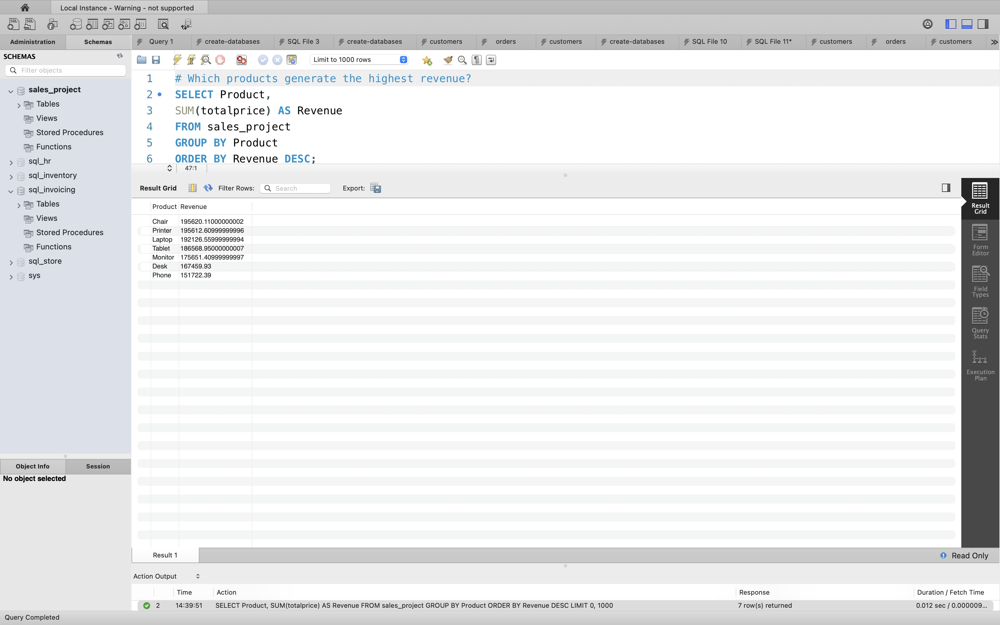
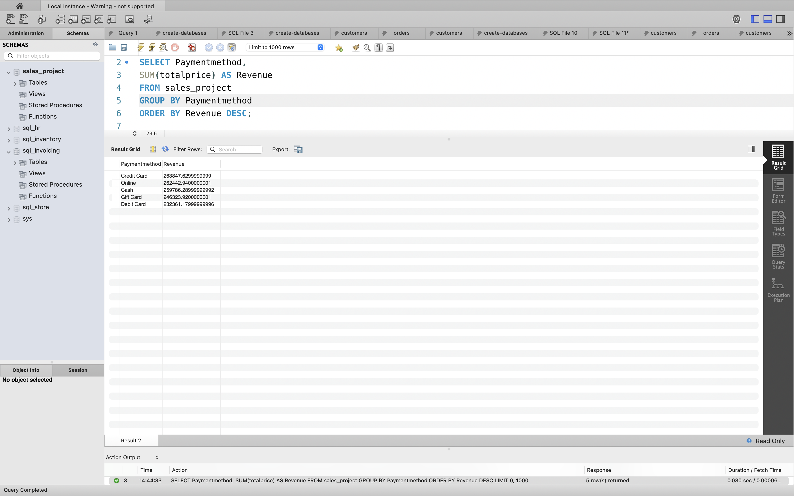
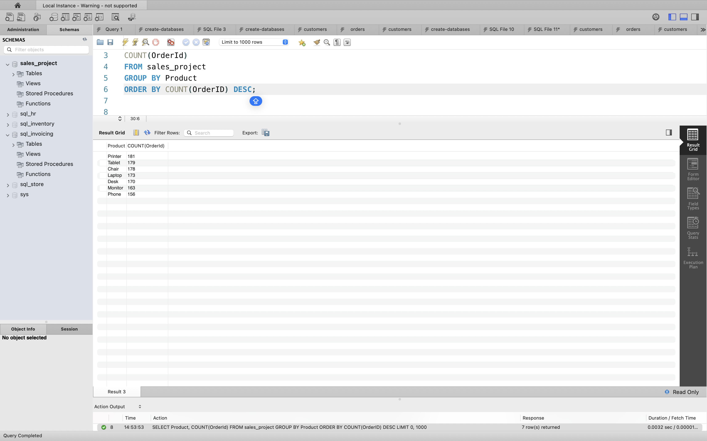
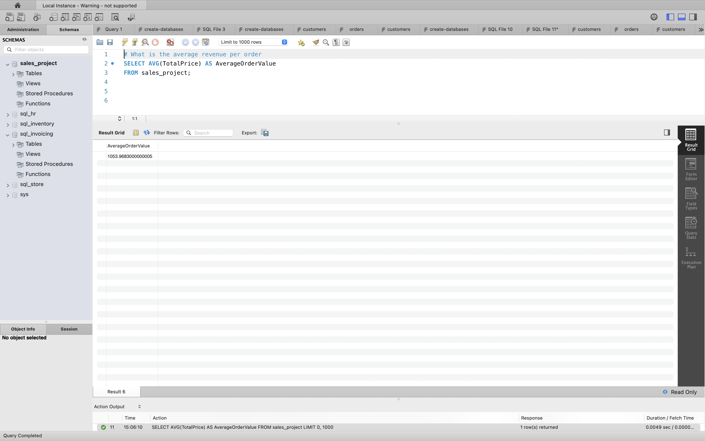
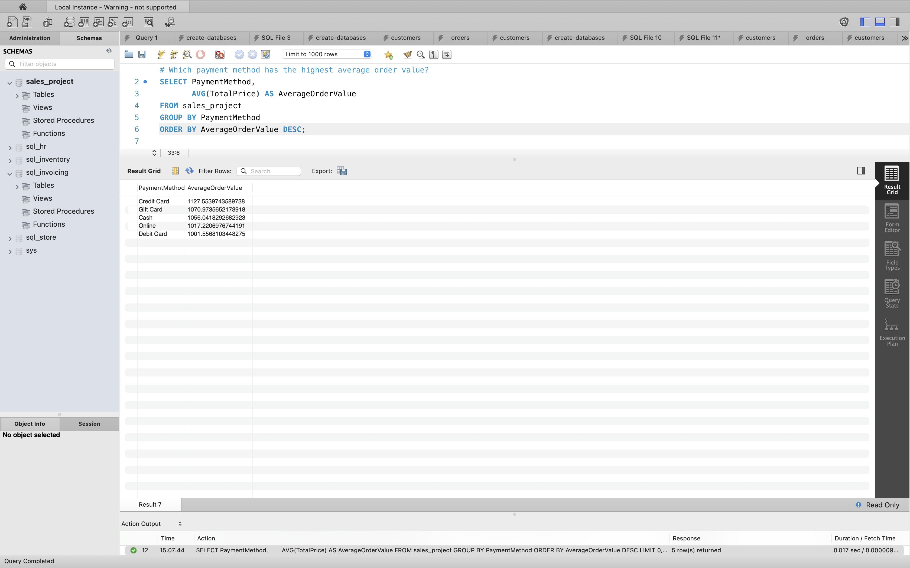

# Decodelabs EDA Sales Analysis

## Project Overview

This project explores retail sales data using SQL to identify sales trends, customer purchasing behaviour, product performance, and revenue opportunities. The analysis was conducted using MySQL and focuses on answering key business questions through data exploration and aggregation techniques.

---

## Business Problem

Retail businesses need to understand:

* Which products generate the highest revenue
* Which payment methods contribute the most revenue
* Which products receive the most customer orders
* Average revenue generated per order
* Which payment methods drive the highest-value transactions

The findings can help support data-driven decision-making related to product strategy, sales performance, and customer purchasing behaviour.

---

## Dataset

The dataset contains retail sales transaction records including:

* OrderID
* Date
* CustomerID
* Product
* Quantity
* UnitPrice
* PaymentMethod
* OrderStatus
* CouponCode
* ReferralSource
* TotalPrice

---

## Business Questions

### 1. Which products generate the highest revenue?

```sql
SELECT Product,
       SUM(TotalPrice) AS Revenue
FROM sales_project
GROUP BY Product
ORDER BY Revenue DESC;
```

### Result



---

### 2. Which payment methods generate the most revenue?

```sql
SELECT PaymentMethod,
       SUM(TotalPrice) AS Revenue
FROM sales_project
GROUP BY PaymentMethod
ORDER BY Revenue DESC;
```

### Result



---

### 3. Which products receive the most orders?

```sql
SELECT Product,
       COUNT(OrderID) AS TotalOrders
FROM sales_project
GROUP BY Product
ORDER BY TotalOrders DESC;
```

### Result



---

### 4. What is the average revenue per order?

```sql
SELECT AVG(TotalPrice) AS AverageOrderValue
FROM sales_project;
```

### Result



---

### 5. Which payment method has the highest average order value?

```sql
SELECT PaymentMethod,
       AVG(TotalPrice) AS AverageOrderValue
FROM sales_project
GROUP BY PaymentMethod
ORDER BY AverageOrderValue DESC;
```

### Result



---

## SQL Skills Demonstrated

* SELECT
* WHERE
* COUNT
* SUM
* AVG
* GROUP BY
* ORDER BY
* Aggregate Functions
* Aliases (AS)
* Business Data Analysis
* Exploratory Data Analysis (EDA)

---

## Key Findings

* Chair generated the highest revenue (£195,620.11).
* Printer generated the second-highest revenue (£195,612.61).
* Phone generated the lowest revenue (£151,722.39).
* Credit Card generated the highest overall revenue among payment methods.
* Debit Card generated the lowest overall revenue.
* Chair recorded the highest number of customer orders.
* Phone recorded the lowest number of customer orders.
* Average order value exceeded £1,000, indicating relatively high-value transactions across the dataset.

---

## Business Recommendations

1. Increase promotion of high-performing products such as Chairs and Printers to maximise revenue.
2. Investigate the lower performance of Phones and identify opportunities to improve sales.
3. Encourage payment methods associated with higher transaction values through targeted incentives.
4. Monitor product demand regularly to optimise inventory management.
5. Use sales insights to support marketing campaigns and pricing strategies.

---

## Tools Used

* MySQL
* SQL
* Data Analysis
* Exploratory Data Analysis (EDA)
* GitHub

---

## Author

**Lydia Akosah**

Aspiring Data Analyst | MSc Digital Health

Decodelabs Data Analytics Project
